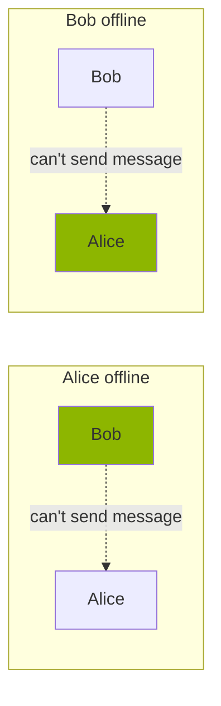
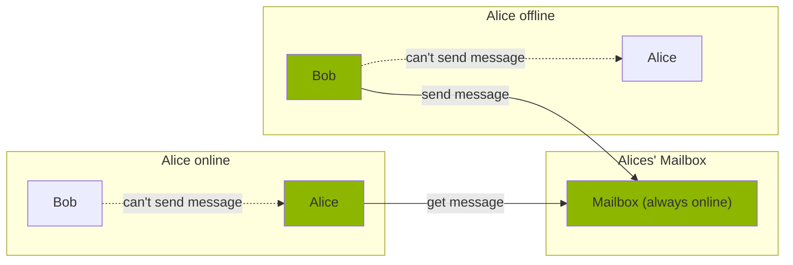

# Briar Mailbox

This project aims to develop an easy way for Briar users to increase their 
reachability and lower the battery drain of their phone.

In Briar messages are exchanged directly between contacts (peer-to-peer). 
This kind of synchronous message exchange requires contacts to be online and 
connected to each other.  
While this is great for privacy (no central server which
can log things or be censored) it's bad for reachability, especially in
mobile networks where connectivity can be limited.

Message delivery could be delayed for an arbitrary time (or even indefinitely) 
until both Bob and Alice are online at the same time.  
The mailbox solves this problem by providing 
a message buffer where contacts can leave messages for the owner 
of the mailbox and which is connected to a stable internet connection 
(e.g. the wifi at home, cable internet) and a power source.
 

## Hardware

We want the mailbox to be as easy to deploy as possible. The target for this project
will come as Android application since it will be easy to setup and besides a 
spare phone, no special hardware is required. Once this is done support for
any hardware supporting Java (e.g. unix server, raspberry pi) could be added.

## Features

### Core features

* Allow contacts to store messages for the owner of the mailbox
* Allow the owner to store messages for her contacts. Contacts can pick them up
  when syncing with the mailbox.
* Owner and contacts connect to the mailbox via Tor.

### Extended features/components

* The mailbox can sync group messages (from groups the owner is part of) with 
  other group members (increases message circulation)
* Contacts and the owner can connect to the mailbox via other transports (Bluetooth, Wifi-Direct, Lan)
* Push-like message notification for the owner to decrease battery drain

